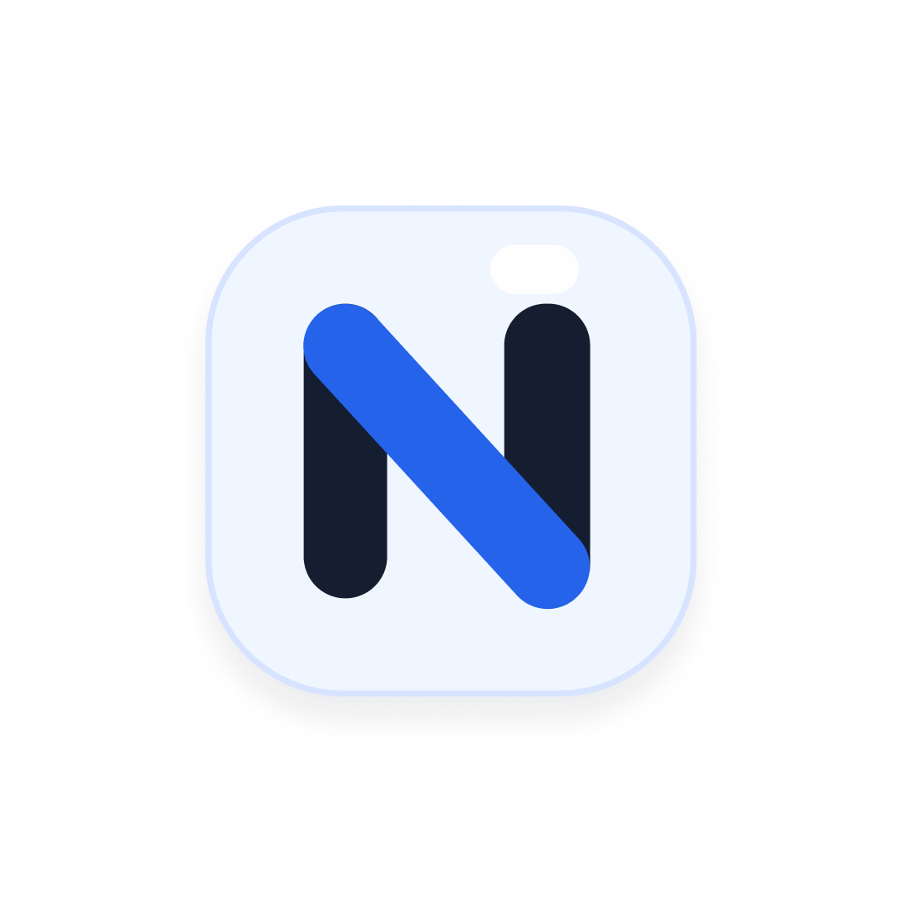

# 🚀 Nara Premium (Nara Apps v2)

<p align="center">
  
</p>

<p align="center">
  <strong>Platform E-Commerce Otomatis Penjualan Produk Digital & Akun Premium 24/7</strong><br>
  <em>Direct-to-Consumer Digital Store with Real-time QRIS Payment, Auto-Fulfillment API, and Instant WhatsApp Notifications.</em>
</p>

<p align="center">
  
  
  
  
  
  
</p>

---

## 📖 Tentang Project

**Nara Premium** adalah aplikasi web e-commerce *direct-to-consumer* (D2C) yang dirancang untuk mengotomatiskan seluruh siklus penjualan produk digital dan akun premium (seperti CapCut Pro, Canva Pro, Netflix, Spotify, YouTube Premium, ChatGPT Plus, dan lisensi software lainnya).

Aplikasi ini mengatasi masalah lambatnya transaksi manual melalui chat admin dengan menghadirkan ekosistem **100% otomatis tanpa campur tangan manusia**:
1. Pelanggan memilih produk digital di katalog modern berdesain *Neobrutalism*.
2. Membayar secara instan menggunakan QRIS (Midtrans).
3. Webhook mendeteksi pembayaran lunas secara real-time.
4. Sistem backend otomatis meneruskan pesanan ke API supplier (*Premku / Premiumku*).
5. Kredensial akun/lisensi langsung tampil di invoice pembeli dan dikirimkan serentak via notifikasi WhatsApp gateway (*GoWA*).

---

## ✨ Fitur Unggulan

### 🛍️ Untuk Pelanggan (Storefront)
- **Katalog Produk Dinamis:** Pencarian instan dan filter kategori, update harga dan stok otomatis dari provider.
- **Pembayaran QRIS Real-time:** Didukung integrasi Midtrans Core API dengan auto-detect status pembayaran tanpa perlu refresh manual.
- **Auto-Delivery Instan:** Kredensial (email, password, tata cara login) langsung tersedia di halaman invoice sesaat setelah pembayaran sukses.
- **Notifikasi WhatsApp Otomatis:** Pembeli menerima pesan invoice rapi di WhatsApp lengkap dengan detail akun, nomor pesanan, tautan grup update stok, dan kontak admin.
- **Pelacakan Pesanan ("Pesanan Saya"):** Akses kembali riwayat akun yang pernah dibeli cukup dengan memasukkan nomor WhatsApp atau nomor invoice.
- **Desain Neobrutalism Modern:** Tampilan unik, kontras tinggi, micro-interaction halus, serta dukungan tema Dark Mode & Light Mode.
- **Grup WhatsApp & Komunitas:** Tautan langsung di bagian footer dan notifikasi untuk memudahkan pembeli bergabung ke grup update stok dan promo.

### 🤖 Kanal Alternatif Bot Discord (Fase 5)
- **Katalog via Discord:** Jelajah katalog via slash command `/produk` dengan filter kategori dan paging tombol.
- **Guest Checkout Instan:** Pembeli cukup diidentifikasi melalui `discord_user_id` tanpa perlu registrasi atau nomor telepon.
- **QRIS Langsung di Discord:** Menampilkan gambar QRIS Midtrans interaktif di Discord beserta nominal dan batas waktu.
- **Auto-Delivery via DM Discord:** Setelah pembayaran lunas, rincian akun/lisensi otomatis meluncur ke DM Discord pembeli.
- **Cek Status Privat (`/pesanan-saya`):** Pelacakan riwayat pesanan yang terisolasi khusus untuk akun Discord pemanggil demi menjaga privasi.

### 🛡️ Untuk Administrator (Admin Dashboard)
- **Keamanan Ketat:** Terproteksi Supabase Auth JWT dengan verifikasi role Administrator.
- **Statistik & Analitik Penjualan Lengkap:**
  - **Kalkulasi Profit Bersih (Net Profit Margin):** Menghitung laba murni dari selisih harga jual terhadap HPP/modal supplier (`providerPrice` atau `marginValue`).
  - **Filter Periode Bulanan:** Tinjau performa bulan berjalan maupun bulan-bulan sebelumnya.
  - **Auto-Reset Tanggal 1:** Metrik bulanan secara natural mulai dari Rp 0 pada setiap tanggal 1 awal bulan baru.
  - **Akumulasi Menyeluruh (All-Time Overview):** Ringkasan total omzet dan total profit bersih toko sepanjang masa yang selalu terpantau.
  - **Ranking Produk Terlaris:** Peringkat produk berdasarkan unit terjual, omzet kotor, dan laba bersih per produk.
- **Manajemen Produk & Markup Harga:**
  - Sinkronisasi otomatis stok & katalog dari supplier Premiumku API.
  - Pengaturan flat margin markup keuntungan per produk dalam Rupiah.
  - Sakelar aktif/nonaktifkan produk dari etalase.
- **Manajemen Pesanan Real-Time:**
  - Pemantauan status transaksi (*Waiting Payment, Paid, Processing, Completed, Failed*).
  - **Direct WhatsApp Click:** Nomor pembeli langsung dapat diklik untuk membuka chat WhatsApp dengan pesan template pertanyaan pesanan.
  - Fitur retry order manual jika terjadi kendala pada pihak supplier.

---

## 🏗️ Arsitektur Sistem

```
+-------------------------------------------------------------+
|                     PELANGGAN / USER                        |
+-------------------------------------------------------------+
               |                               |
       (1a) Web Store                   (1b) Bot Discord
        (Beli & QRIS)                    (/produk & QRIS)
               v                               v
+-----------------------------+ +-----------------------------+
|   FRONTEND (React + Vite)   | |   BOT (discord.js v14)      |
| TailwindCSS Neobrutalism UI | | Service Node.js Terpisah    |
+-----------------------------+ +-----------------------------+
               |                               |
               +---------------v---------------+
                               |
                   (2) REST API Calls / Polling
                               v
+-------------------------------------------------------------+
|                   BACKEND (Node.js Express)                 |
|             TypeScript + Drizzle ORM + PostgreSQL           |
+-------------------------------------------------------------+
         |                       |                     |
 (3) Callback QRIS        (4) Order API        (5) Notifikasi
         v                       v                     v
+------------------+   +-------------------+   +---------------+
|     MIDTRANS     |   |     PREMIUMKU     |   |  GoWA / DM    |
| Payment Gateway  |   | Supplier Provider |   | WhatsApp / Bot|
+------------------+   +-------------------+   +---------------+
```

---

## 🛠️ Tech Stack

### Frontend
- **Framework:** React 18 + Vite
- **Bahasa:** TypeScript
- **Styling:** Vanilla CSS + TailwindCSS (Custom Neobrutalism Theme)
- **Animasi:** Framer Motion
- **Icons:** Lucide React
- **Routing:** React Router DOM (v6)

### Bot Discord (Fase 5)
- **Library:** discord.js (v14)
- **QR Generator:** qrcode
- **Runtime:** Node.js (v18+)
- **Komunikasi:** REST API Backend

### Backend
- **Runtime:** Node.js (v18+)
- **Framework:** Express.js (ESM modules)
- **Bahasa:** TypeScript
- **Database ORM:** Drizzle ORM
- **Database Engine:** PostgreSQL (Supabase PostgreSQL / Self-Hosted)
- **Autentikasi Admin:** Supabase Auth JWT

### Layanan Pihak Ketiga
- **Midtrans Core API:** Gateway pembayaran QRIS real-time via webhook callback.
- **Premku (Premiumku API):** Layanan pemenuhan pesanan otomatis & sinkronisasi katalog akun digital.
- **GoWA:** WhatsApp Gateway self-hosted multi-device untuk notifikasi instan pelanggan.

---

## 📁 Struktur Folder Proyek

```plaintext
nara-apps-v2/
├── backend/
│   ├── src/
│   │   ├── config/          # Konfigurasi environment & konstanta
│   │   ├── db/              # Skema database Drizzle ORM & koneksi PG
│   │   ├── middleware/      # Middleware autentikasi admin & rate limiter
│   │   ├── routes/          # API endpoints (order, admin, product, webhook)
│   │   ├── services/        # Service layer (order, midtrans, premku, whatsapp)
│   │   └── server.ts        # Entry point aplikasi backend
│   ├── drizzle.config.ts    # Konfigurasi migrasi Drizzle
│   ├── package.json
│   └── tsconfig.json
├── frontend/
│   ├── public/              # Aset statis & logo
│   ├── src/
│   │   ├── components/      # Komponen UI (Navbar, Footer, Modal, Card)
│   │   ├── context/         # Context provider (Admin Auth)
│   │   ├── lib/             # API helpers, phone validation, Supabase client
│   │   ├── pages/           # Halaman publik (Catalog, Order, Invoice, Tracking)
│   │   │   └── admin/       # Halaman dashboard admin (Orders, Products, Analytics)
│   │   ├── App.tsx          # Router utama aplikasi
│   │   └── main.tsx         # Entry point React
│   ├── package.json
│   ├── vite.config.ts
│   └── tailwind.config.js
├── docker-compose.yml       # Konfigurasi Docker multi-container
├── DEPLOYMENT.md            # Panduan instalasi dan deployment VPS
└── README.md                # Dokumentasi utama proyek
```

---

## 🚀 Panduan Instalasi Lokal

### 1. Kloning Repositori
```bash
git clone https://github.com/Ramadani-coding/nara-appsV2.git
cd nara-appsV2
```

### 2. Setup Backend
```bash
cd backend
npm install

# Buat file konfigurasi .env
cp .env.example .env
```
Isi konfigurasi pada `backend/.env`:
- `DATABASE_URL`: URL PostgreSQL (Supabase / lokal).
- `SUPABASE_URL` & `SUPABASE_ANON_KEY`: Kredensial Supabase.
- `PREMIUMKU_BASE_URL` & `PREMIUMKU_API_KEY`: Kredensial API supplier.
- `MIDTRANS_SERVER_KEY` & `MIDTRANS_CLIENT_KEY`: Kredensial Midtrans.
- `GOWA_BASE_URL`, `GOWA_DEVICE_ID`, `GOWA_BASIC_AUTH_...`: Kredensial WhatsApp Gateway.
- `ADMIN_WHATSAPP_PHONE`: Nomor admin WhatsApp untuk bantuan (misal: `085750231336`).
- `WHATSAPP_GROUP_URL`: Link undangan grup WhatsApp pelanggan.

Jalankan backend di mode development:
```bash
npm run dev
```

### 3. Setup Frontend
Buka terminal baru:
```bash
cd frontend
npm install

# Buat file konfigurasi .env
cp .env.example .env
```
Isi konfigurasi pada `frontend/.env`:
```env
VITE_API_BASE_URL=http://localhost:5001/api
VITE_SUPABASE_URL=https://[YOUR_SUPABASE_PROJECT].supabase.co
VITE_SUPABASE_ANON_KEY=[YOUR_SUPABASE_KEY]
```

Jalankan frontend:
```bash
npm run dev
```
Buka browser di `http://localhost:5173`.

---

## 🌐 Panduan Deployment di VPS

### Opsi A: Deployment Native (PM2 + Nginx)

1. **Tarik Kode Terbaru:**
   ```bash
   cd /var/www/nara-apps-v2
   git pull origin main
   ```

2. **Build Backend:**
   ```bash
   cd backend
   npm install
   npm run build
   pm2 restart nara-backend || pm2 start dist/server.js --name "nara-backend"
   ```

3. **Build Frontend:**
   ```bash
   cd ../frontend
   npm install
   npm run build
   ```
   Arahkan `root` konfigurasi Nginx Anda ke folder `frontend/dist`.

### Opsi B: Menggunakan Docker Compose
```bash
docker compose up -d --build
```

---

## 🤝 Kontribusi & Lisensi

Proyek ini dikembangkan oleh **Ramadani** untuk operasional toko digital **Nara Premium**.
Didistribusikan di bawah lisensi privat / proprietary. Seluruh hak cipta dilindungi undang-undang.
