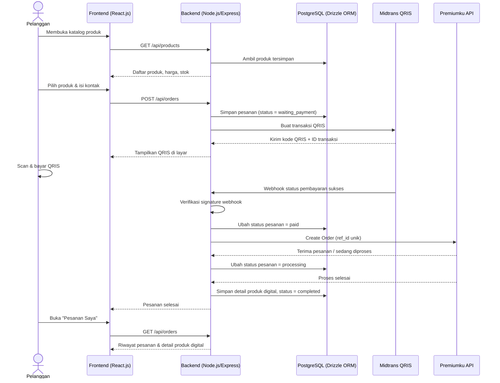
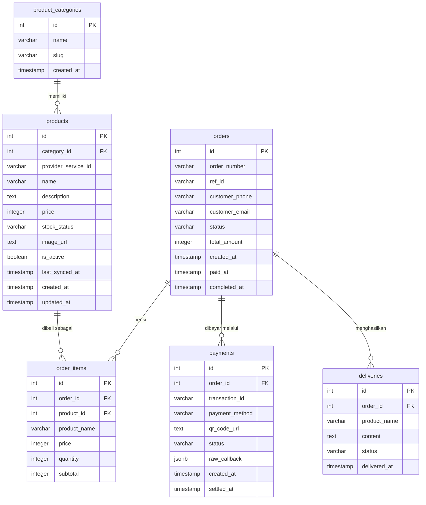

# PRD — Project Requirements Document

## 1. Overview

### Masalah yang Diselesaikan

Konsumen produk digital premium — seperti Capcut Pro, Alight Motion, atau layanan berlangganan lainnya — selama ini masih membeli secara manual dari penjual. Prosesnya lambat, tidak selalu tersedia 24 jam, rawan salah kirim atau pesanan ganda, dan menyulitkan pembeli karena harus menunggu admin membalas.

### Tujuan Aplikasi

Membangun platform web otomatis yang menjual produk digital premium langsung ke konsumen (direct to consumer) dengan alur hampir tanpa campur tangan manusia:

1. Pelanggan melihat dan memilih produk digital dari katalog.
2. Pelanggan membayar dengan memindai QRIS Midtrans.
3. Sistem menerima notifikasi pembayaran sukses secara otomatis.
4. Sistem langsung memesan produk ke penyedia (Premiumku).
5. Detail produk digital dikirimkan/ditampilkan ke pelanggan setelah pesanan selesai diproses.

Dengan begitu, transaksi dapat berjalan otomatis 24 jam, cepat, real-time, dan bebas dari proses manual yang lambat.

---

## 2. Requirements

### Kebutuhan Fungsional Utama

- **Katalog Produk**
  - Aplikasi mampu menampilkan produk digital premium berikut harga, deskripsi, stok, dan gambar produk.
  - Produk dapat dicari berdasarkan kata kunci dan disaring berdasarkan kategori.
  - Harga dan stok disinkronkan dari API Premiumku sehingga informasi yang tampil tetap up-to-date.

- **Pemesanan & Pembayaran QRIS**
  - Pelanggan mengisi kontak (WhatsApp/email) saat membuat pesanan.
  - Sistem membuat transaksi pembayaran QRIS melalui Midtrans Core API.
  - Halaman pembayaran menampilkan QRIS dan memandu pelanggan sampai dinyatakan lunas.

- **Pemrosesan Otomatis Tanpa Admin**
  - Saat Midtrans mengirim webhook status sukses, sistem langsung memproses pesanan ke Premiumku.
  - Sistem harus mencegah duplikasi pesanan dengan mengirim `ref_id` unik (fitur idempotency dari Premiumku).
  - Setelah Premiumku menyelesaikan pesanan, detail produk digital otomatis tersedia untuk pelanggan.

- **Pesanan Saya**
  - Pelanggan dapat melihat riwayat pesanan, mencari pesanan tertentu, dan membuka kembali rincian produk digital yang sudah dibeli.

### Kebutuhan Non-Fungsional

- **Keamanan:**
  - `api_key` Premiumku dan server key Midtrans hanya disimpan di sisi server, tidak pernah muncul di frontend.
  - Webhook Midtrans wajib diverifikasi signature-nya agar notifikasi palsu tidak bisa memicu pesanan.
  - Kredensial produk digital yang sensitif sebaiknya disimpan terenkripsi di database.

- **Keandalan:**
  - Sistem dirancang berjalan 24/7 dengan pemrosesan otomatis.
  - Setiap pesanan memiliki status yang jelas sehingga mudah dilacak dan diperbaiki bila terjadi kendala.
  - Idempotency menggunakan `ref_id` unik untuk memastikan tidak ada pesanan dobel, baik saat ulang klik maupun notifikasi webhook yang terkirim lebih dari sekali.

- **Deployment:**
  - Seluruh aplikasi (frontend, backend, dan database) dikemas dengan Docker sehingga mudah dijalankan di berbagai server.

---

## 3. Core Features

### Fase 1 — Katalog Produk

Halaman utama yang menjadi tempat pelanggan melihat, mencari, dan membuka produk digital premium.

- **Daftar Produk**
  Menampilkan seluruh produk digital dalam bentuk kartu berisi gambar, nama produk, harga, dan status ketersediaan (tersedia/habis).

- **Cari Produk**
  Pelanggan dapat mencari produk dengan cepat menggunakan kata kunci nama atau jenis produk.

- **Kategori Produk**
  Produk dikelompokkan dalam kategori agar pelanggan lebih mudah menjelajah, misalnya kategori editor video, musik, atau aplikasi berlangganan.

- **Detail Produk**
  Halaman rinci produk yang menampilkan deskripsi, harga terbaru, dan stok real-time dari Premiumku sebelum pelanggan memutuskan membeli.

### Fase 2 — Pembelian QRIS

Alur inti transaksi: pilih produk → bayar QRIS → sistem memproses otomatis → pelanggan menerima produk.

- **Formulir Pesanan**
  Pelanggan mengisi kontak yang bisa dihubungi, seperti nomor WhatsApp atau email, sebagai data tujuan pengiriman produk digital.

- **Ringkasan Pesanan**
  Menampilkan kembali produk yang dipilih, jumlah, dan total harga agar pelanggan bisa memeriksa ulang sebelum membayar.

- **Bayar dengan QRIS**
  Sistem membuat kode QRIS lewat Midtrans Core API dan menampilkannya di layar. Halaman ini juga memandu pelanggan hingga pembayaran dinyatakan sukses.

- **Proses dan Kirim Otomatis**
  Setelah status pembayaran sukses diterima dari webhook Midtrans, backend secara otomatis membuat pesanan ke API Premiumku menggunakan `ref_id` unik agar tidak terjadi duplikasi. Tidak diperlukan admin manusia untuk tahap ini.

- **Terima Produk Digital**
  Begitu Premiumku menyelesaikan pesanan, detail produk digital (misalnya kode aktivasi, akun, atau link akses) langsung ditampilkan dan tersimpan di halaman pesanan pelanggan.

### Fase 3 — Pesanan Saya

Kumpulan transaksi yang sudah dibuat sehingga pelanggan bisa melacak dan membuka lagi produknya.

- **Daftar Riwayat**
  Menampilkan semua pesanan lama lengkap dengan status pesanan, tanggal transaksi, dan total pembelian.

- **Cari Pesanan**
  Pelanggan dapat mencari pesanan tertentu dari riwayat menggunakan nomor order atau nama produk.

- **Detail Pesanan**
  Membuka rincian satu pesanan, termasuk produk yang dibeli, status proses (dibayar/diproses/selesai), dan detail produk digital yang sudah diterima.

---

## 4. User Flow

Berikut perjalanan pengguna, disusun sesuai urutan fase pada roadmap.

### Alur Katalog (Fase 1)

1. Pelanggan membuka aplikasi dan melihat halaman katalog produk.
2. Pelanggan mencari produk dengan kata kunci atau memilih kategori tertentu.
3. Pelanggan membuka halaman detail produk untuk melihat deskripsi, harga terkini, dan ketersediaan stok.
4. Jika tertarik, pelanggan menekan tombol beli dan lanjut ke alur pembayaran.

### Alur Pembelian QRIS (Fase 2)

5. Pelanggan mengisi formulir pesanan berupa kontak WhatsApp atau email.
6. Sistem menampilkan ringkasan pesanan: produk, jumlah, dan total harga. Pelanggan memeriksa lalu mengonfirmasi.
7. Backend menyimpan pesanan berstatus **menunggu pembayaran** dan meminta transaksi QRIS ke Midtrans Core API.
8. Halaman pembayaran menampilkan kode QRIS. Pelanggan memindai QRIS menggunakan aplikasi e-wallet atau mobile banking dan menyelesaikan pembayaran.
9. Midtrans mengirim notifikasi (webhook) status sukses ke backend.
10. Backend memverifikasi webhook, lalu mengubah status pesanan menjadi **lunas**.
11. Backend otomatis memanggil API Premiumku (Create Order) dengan `ref_id` unik agar pesanan tidak ganda.
12. Premiumku menerima dan memproses pesanan. Saat selesai, backend memperbarui status menjadi **sukses/selesai** dan menyimpan detail produk digital.
13. Pelanggan melihat notifikasi bahwa pesanan selesai dan produk digitalnya siap diakses.

### Alur Riwayat Pesanan (Fase 3)

14. Pelanggan membuka halaman **Pesanan Saya** untuk melihat daftar riwayat transaksi.
15. Pelanggan dapat mencari pesanan tertentu berdasarkan nomor order atau nama produk.
16. Pelanggan membuka detail pesanan untuk melihat rincian transaksi dan membuka kembali produk digital yang sudah dibeli.

---

## 5. Architecture

Aplikasi dibangun dengan arsitektur client-server sederhana:

1. **Frontend (React.js)** — halaman katalog, pembayaran QRIS, dan pesanan saya. Frontend hanya berkomunikasi dengan backend; tidak pernah menyimpan kunci API pihak ketiga.
2. **Backend (Node.js + Express.js)** — menyediakan REST API untuk aplikasi, membuat transaksi QRIS ke Midtrans, memproses webhook Midtrans, dan memanggil API Premiumku.
3. **Database (PostgreSQL via Drizzle ORM)** — menyimpan data produk, pesanan, pembayaran, dan produk digital yang sudah dibeli.
4. **Payment Gateway (Midtrans Core API)** — menghasilkan kode QRIS dan mengirim notifikasi pembayaran.
5. **Supplier API (Premiumku)** — sumber katalog produk dan tempat sistem memesan/memproses produk digital.
6. **Docker** — seluruh komponen dikemas dan dijalankan bersama.

### Alur Sistem dalam Satu Transaksi

### Catatan Keamanan Arsitektur

- Kunci `api_key` Premiumku dan server key Midtrans hanya tersimpan di environment variable backend, tidak pernah dikirim ke frontend.
- Webhook Midtrans dicek signature-nya sebelum pesanan diproses agar hanya notifikasi asli yang memicu auto-order.
- Setiap pengiriman ke Premiumku menyertakan `ref_id` unik (nomor/nomor internal pesanan) untuk mencegah duplikasi pesanan akibat request ganda.

---

## 6. Database Schema

Rancangan awal tabel/koleksi yang dibutuhkan. Nilai `status` memakai istilah internal berbahasa Inggris untuk memudahkan integrasi dengan API.

### `product_categories`

Kategori untuk mengelompokkan produk digital.

| Kolom | Tipe | Kegunaan |
|---|---|---|
| `id` | int (PK) | Identitas unik kategori |
| `name` | varchar | Nama kategori |
| `slug` | varchar | URL yang ramah untuk kategori |
| `created_at` | timestamp | Waktu kategori dibuat |

### `products`

Produk digital premium yang ditampilkan di katalog. Data disinkronkan dari API Premiumku.

| Kolom | Tipe | Kegunaan |
|---|---|---|
| `id` | int (PK) | Identitas produk di aplikasi |
| `category_id` | int (FK) | Menautkan produk ke kategori |
| `provider_service_id` | varchar | ID layanan produk di Premiumku; dipakai saat Create Order |
| `name` | varchar | Nama produk yang tampil di katalog |
| `description` | text | Deskripsi produk |
| `price` | integer | Harga produk dalam Rupiah |
| `stock_status` | varchar | Status stok dari Premiumku (tersedia/habis) |
| `image_url` | text | URL gambar produk |
| `is_active` | boolean | Menandai apakah produk ditampilkan atau tidak |
| `last_synced_at` | timestamp | Waktu terakhir data disinkronkan dari Premiumku |
| `created_at` | timestamp | Waktu produk ditambahkan |
| `updated_at` | timestamp | Waktu produk diperbarui |

### `orders`

Data pesanan utama.

| Kolom | Tipe | Kegunaan |
|---|---|---|
| `id` | int (PK) | Identitas pesanan di database |
| `order_number` | varchar | Nomor order yang tampil ke pelanggan |
| `ref_id` | varchar (unik) | ID transaksi unik untuk idempotency di Premiumku |
| `customer_phone` | varchar | Kontak WhatsApp pembeli |
| `customer_email` | varchar | Email pembeli |
| `status` | varchar | Status pesanan: `waiting_payment`, `paid`, `processing`, `completed`, `failed`/`expired` |
| `total_amount` | integer | Total tagihan dalam Rupiah |
| `created_at` | timestamp | Waktu pesanan dibuat |
| `paid_at` | timestamp | Waktu pembayaran sukses |
| `completed_at` | timestamp | Waktu pesanan selesai dan produk terkirim |

### `order_items`

Detail rinci produk yang dibeli pada tiap pesanan.

| Kolom | Tipe | Kegunaan |
|---|---|---|
| `id` | int (PK) | Identitas item |
| `order_id` | int (FK) | Menautkan item ke pesanan |
| `product_id` | int (FK) | Produk yang dibeli |
| `product_name` | varchar | Salinan nama produk saat dibeli (snapshot) |
| `price` | integer | Harga produk saat dibeli (snapshot) |
| `quantity` | integer | Jumlah produk dibeli |
| `subtotal` | integer | Total harga untuk item ini |

### `payments`

Data transaksi QRIS yang dibuat lewat Midtrans.

| Kolom | Tipe | Kegunaan |
|---|---|---|
| `id` | int (PK) | Identitas pembayaran |
| `order_id` | int (FK) | Pesanan yang dibayar |
| `transaction_id` | varchar | ID transaksi dari Midtrans |
| `payment_method` | varchar | Metode pembayaran, diisi `qris` |
| `qr_code_url` | text | URL tampilan kode QRIS |
| `status` | varchar | Status pembayaran (pending/sukses/gagal) |
| `raw_callback` | jsonb | Data mentah webhook dari Midtrans untuk audit |
| `created_at` | timestamp | Waktu transaksi dibuat |
| `settled_at` | timestamp | Waktu pembayaran dinyatakan sukses |

### `deliveries`

Detail produk digital yang diterima pelanggan setelah pesanan diproses Premiumku.

| Kolom | Tipe | Kegunaan |
|---|---|---|
| `id` | int (PK) | Identitas pengiriman produk |
| `order_id` | int (FK) | Pesanan yang menerima produk |
| `product_name` | varchar | Nama produk digital yang dikirim |
| `content` | text | Isi produk digital (akun/kode/link akses); disarankan disimpan terenkripsi |
| `status` | varchar | Status pengiriman, misalnya `delivered` |
| `delivered_at` | timestamp | Waktu produk digital tersedia untuk pelanggan |

### Diagram Relasi Database

---

## 7. Tech Stack

Berikut teknologi yang direkomendasikan sesuai pilihan pada input proyek.

| Layer | Teknologi | Keterangan |
|---|---|---|
| **Frontend** | React.js + Tailwind CSS | Antarmuka pengguna modern dan responsif; dapat ditambah pustaka komponen berbasis Tailwind (misal shadcn/ui) agar pengembangan UI lebih cepat |
| **Backend** | Node.js + Express.js | REST API, pembuatan transaksi QRIS, penerima webhook, dan pemanggilan API Premiumku |
| **Database** | PostgreSQL | Menyimpan data produk, pesanan, pembayaran, dan pengiriman produk digital |
| **ORM** | Drizzle ORM | TypeScript ORM ringan tanpa dependensi, serverless-ready, dan selalu menghasilkan 1 query SQL untuk operasi data |
| **Payment Gateway** | Midtrans Core API | Pembayaran eksklusif menggunakan QRIS; webhook diproses backend untuk memicu auto-order |
| **Supplier API** | Premiumku (premku.com) | Sumber katalog produk (harga/stok real-time) dan pemrosesan Create Order dengan parameter `ref_id` sebagai idempotency |
| **Deployment** | Docker | Mengemas frontend, backend, dan database agar mudah di-deploy secara konsisten; kunci API disimpan melalui environment variable |

Catatan: Kunci rahasia (`api_key` Premiumku dan server key Midtrans) hanya dipegang oleh backend dan tidak pernah diekspos ke sisi frontend.

---

## 8. Desain Visual & Branding

Gaya tampilan mengikuti referensi UI toko digital pada tangkapan layar (layout modern, bersih, tipografi tebal, blok kontras), tetapi dengan palet warna utama **biru** dan **pink** sebagai pengganti kombinasi ungu-kuning-hitam pada referensi.

### Palet Warna

| Peran | Warna | Nilai Heksa (saran) | Penggunaan |
|---|---|---|---|
| Primary | Biru | `#3B82F6` (gradasi `#2563EB`) | Tombol utama (CTA), link, aksen aktif, elemen interaktif |
| Secondary / Aksen | Pink | `#EC4899` (gradasi `#F472B6`) | Label kategori/tag kecil, ikon fitur, badge diskon, highlight |
| Background utama | Putih/terang | `#FFFFFF` / `#F8FAFC` | Latar halaman & kartu |
| Background gelap (opsional dark mode) | Biru gelap | `#0B1220` / `#1E293B` | Mode gelap |
| Teks utama | Hitam/abu pekat | `#0F172A` | Judul & isi teks |
| Teks sekunder | Abu | `#64748B` | Deskripsi, sub-teks |
| Border/garis | Abu tipis | `#E2E8F0` | Pemisah, kartu |

Catatan: Tetapkan token warna sebagai variabel Tailwind (`primary`, `accent`, `surface`, dst.) agar dipakai konsisten di semua komponen dan mudah diganti.

### Komponen Layout

**1. Navbar / Header**
- Logo berupa ikon kotak/rounded dengan inisial toko (mis. "TP") di samping nama brand, dengan aksen gradasi biru–pink.
- Menu navigasi: **Home, Produk, Kategori, Cara Order, FAQ**.
- Utilitas kanan: toggle dark mode, ikon akun user, ikon keranjang.

**2. Hero Section (beranda)**
- Tag kategori kecil (pill) pink bertuliskan label segmen, mis. **"DIGITAL STORE"**.
- Headline besar dengan efek bayangan/3D pada kata kunci, mis. **"Premium Digital Products"** — teks atau bayangan beraksen biru–pink.
- Sub-headline singkat menjelaskan nilai jual dan alur praktis.
- Dua tombol: tombol primer biru berisi ajakan belanja (mis. **"BELANJA SEKARANG"**) dan tombol sekunder bergaris hitam untuk petunjuk (**"LIHAT CARA ORDER"**).
- Ilustrasi/visual kanan berupa kartu-kotak miring berlabel seperti "YOUR DIGITAL STORE", "PREMIUM ACCESS", dan label harga awal (mis. **"START Rp3K"**) dengan aksen biru–pink.
- Baris statistik/social proof 3 kotak: **"TOTAL PRODUK"**, **"CUSTOMER"**, **"ORDER ONLINE"** (contoh 22+, 1K+, 24/7).

**3. Value Proposition Footer / baris bawah**
- 4 kolom fitur dengan ikon berwarna pink, mis. **Pembayaran Aman** ("Proses order terstruktur"), plus kolom sejenis lain (kecepatan proses, dukungan, dll.).

**4. Halaman Katalog (Products)**
- Breadcrumb, mis. `STORE / PRODUCTS`.
- Judul halaman + sub-header singkat.
- Input pencarian dengan ikon kaca pembesar.
- Dropdown sorting (mis. "Terbaru").
- Filter kategori berbentuk pill horizontal: **Semua, Premium Account, Subscription, Digital Service, Bot Alight Motion, Lainnya**.

**5. Kartu Produk**
- Gambar produk dengan latar abstrak gradasi biru–pink sesuai produk.
- Badge diskon (mis. "30% OFF") pink di pojok kiri atas gambar.
- Ikon wishlist di pojok kanan atas.
- Label kategori kecil di atas judul, lalu nama produk dan harga.

### Prinsip Penerapan
- Layout & posisi elemen meniru referensi agar nuansanya familier, hanya palet warna yang diganti ke biru & pink.
- Warna biru untuk tindakan utama (beli/bayar/navigasi aktif), pink untuk penanda perhatian (diskon, tag, ikon fitur).
- Konsisten pakai token warna global, dukungan dark mode, dan responsif untuk mobile.